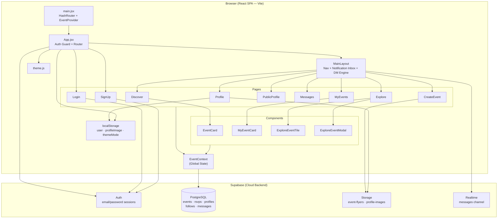
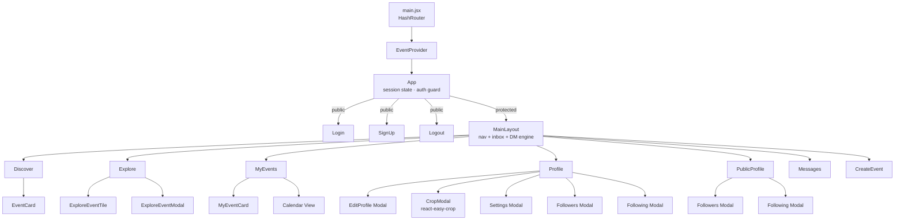
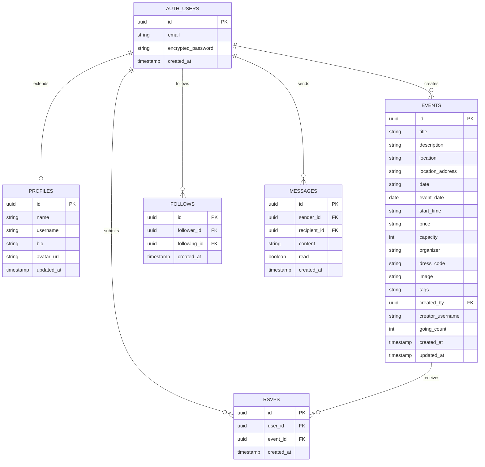
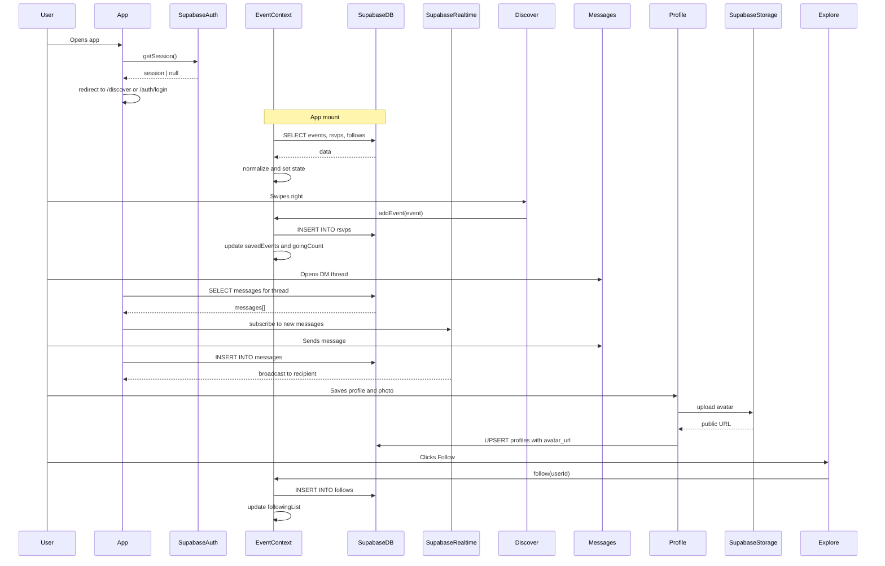
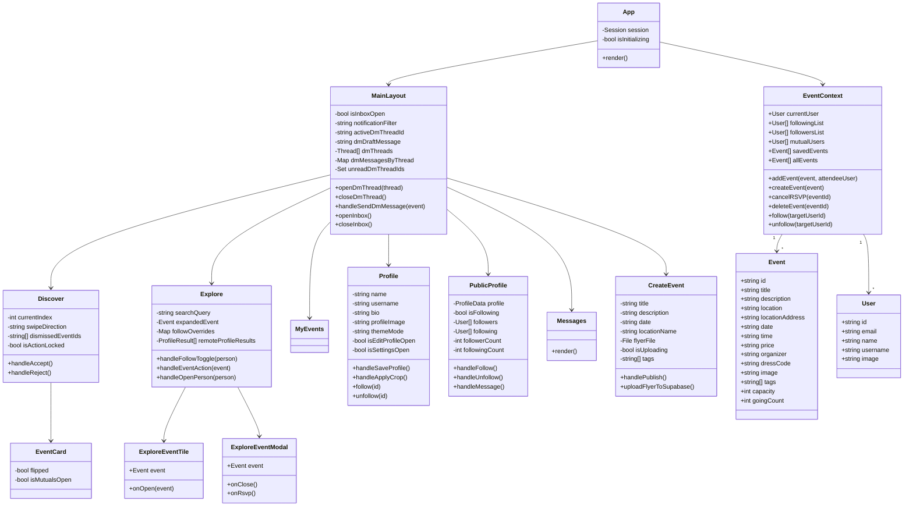

# Campus Event Navigation — UML Diagrams

> **How to view:** Install the [Markdown Preview Mermaid Support](https://marketplace.visualstudio.com/items?itemName=bierner.markdown-mermaid) VS Code extension, open this file, and press `Ctrl+Shift+V`. Diagrams also render automatically on GitHub.

---

## 1. System Architecture

---

## 2. Component Hierarchy

---

## 3. Database Schema (ER Diagram)

---

## 4. Key Data Flows (Sequence Diagram)

---

## 5. Class Diagram

