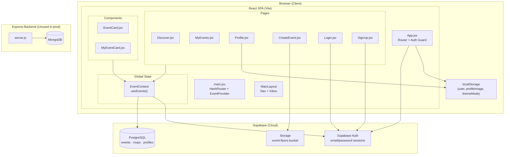
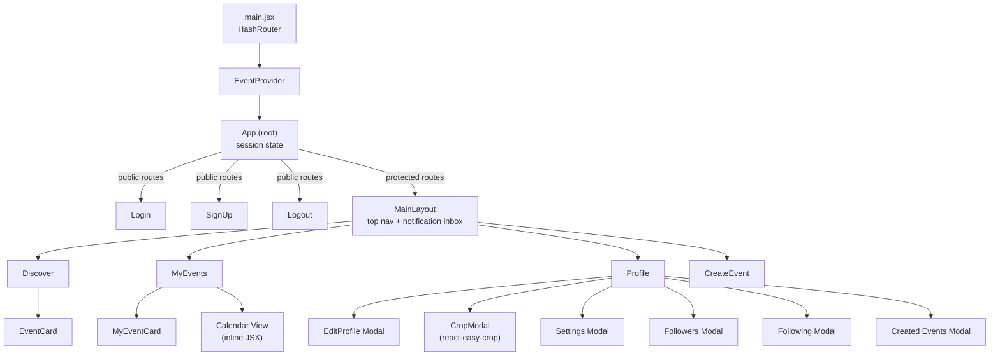
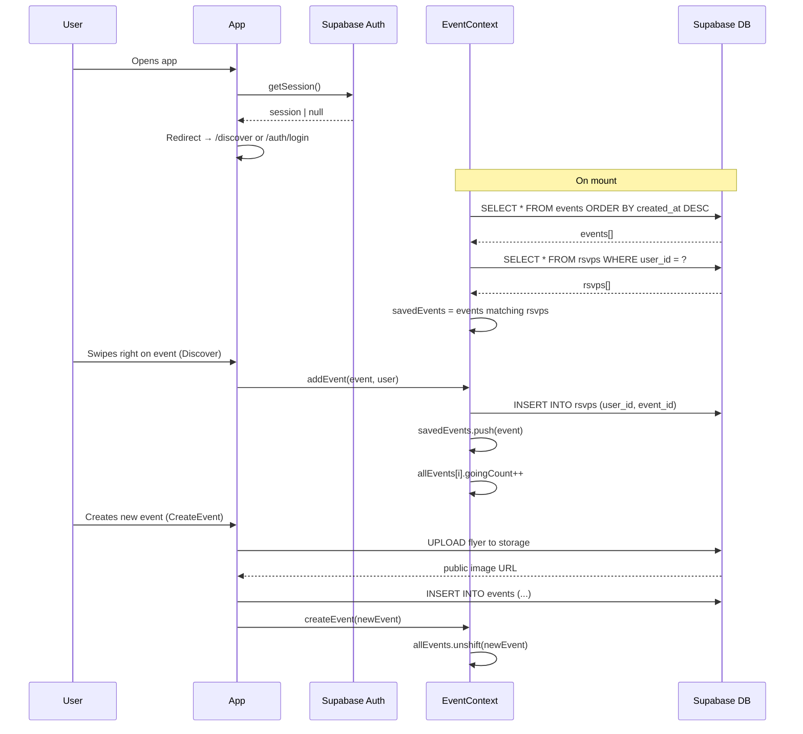
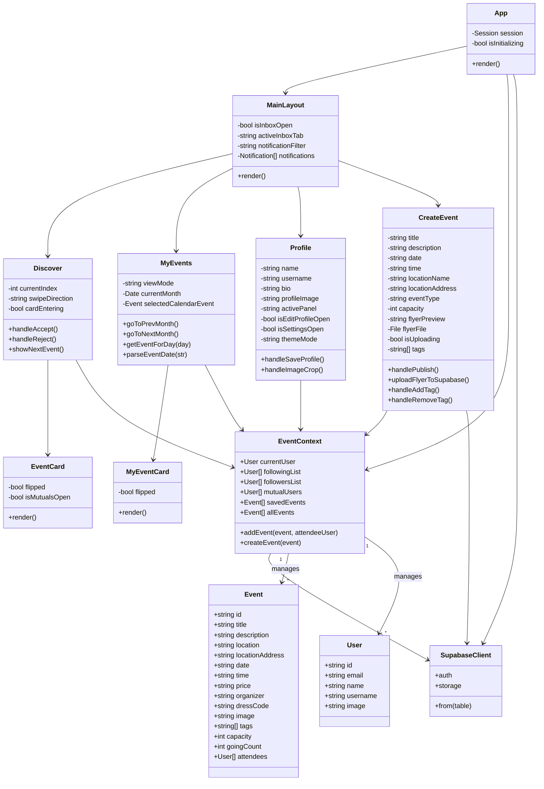
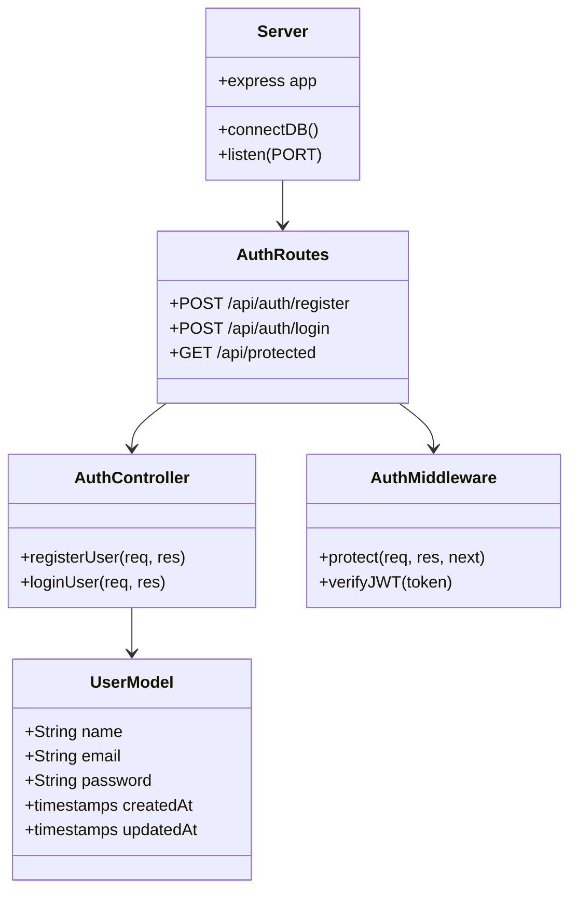

# Campus Event Navigation — UML Diagrams

> Render these diagrams with the [Mermaid VS Code extension](https://marketplace.visualstudio.com/items?itemName=bierner.markdown-mermaid) or view on GitHub.

---

## 1. System Architecture



---

## 2. Component Hierarchy



---

## 3. Data Model (ER Diagram)

```mermaid
erDiagram
    AUTH_USERS {
        uuid id PK
        string email
        string encrypted_password
        timestamp created_at
    }

    PROFILES {
        uuid id PK_FK
        string name
        string username
        string bio
        timestamp updated_at
    }

    EVENTS {
        uuid id PK
        string title
        string description
        string location
        string location_address
        string date
        date event_date
        string start_time
        string price
        int capacity
        string organizer
        string dress_code
        string image
        string[] tags
        uuid created_by FK
        string creator_username
        int going_count
        timestamp created_at
        timestamp updated_at
    }

    RSVPS {
        uuid id PK
        uuid user_id FK
        uuid event_id FK
        timestamp created_at
    }

    AUTH_USERS ||--o| PROFILES : "extends"
    AUTH_USERS ||--o{ EVENTS : "creates"
    AUTH_USERS ||--o{ RSVPS : "submits"
    EVENTS ||--o{ RSVPS : "receives"
```

---

## 4. State & Data Flow



---

## 5. Class Diagram (Frontend)



---

## 6. Backend (Express — Auth Fallback)



